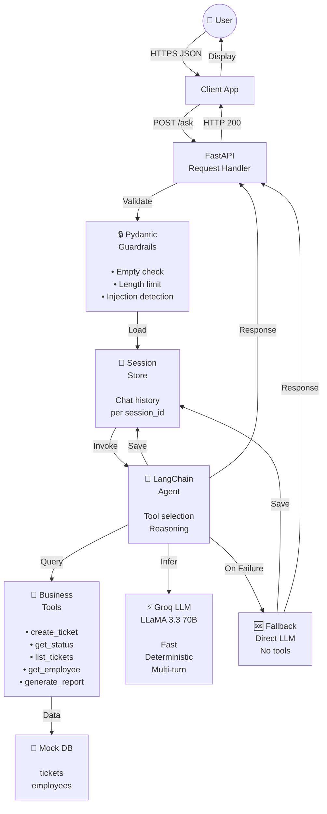
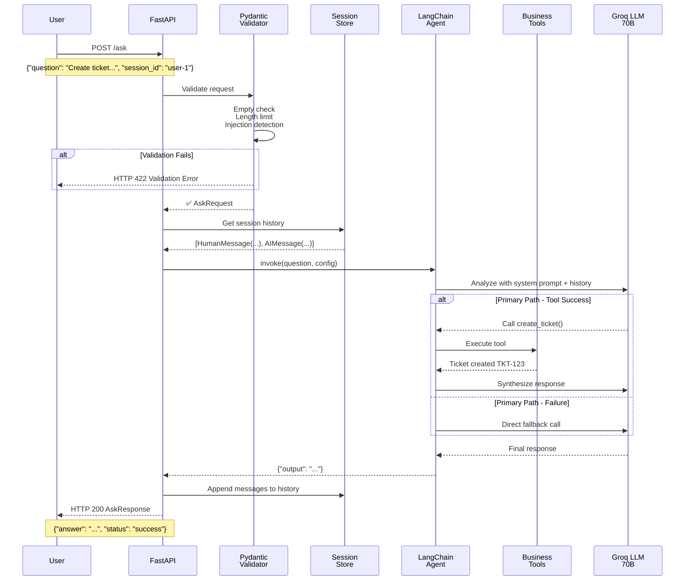
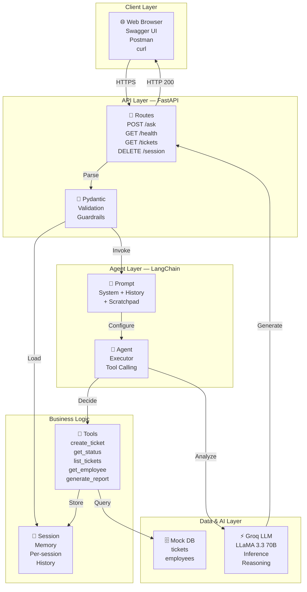
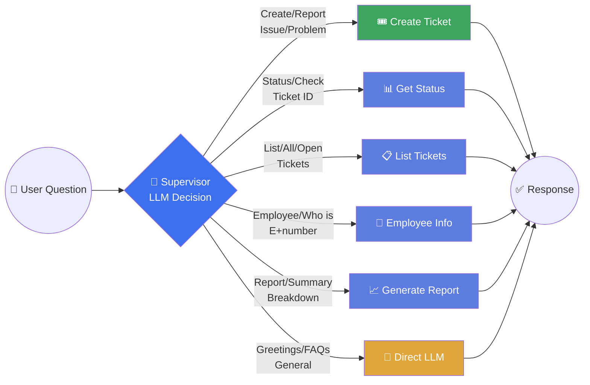
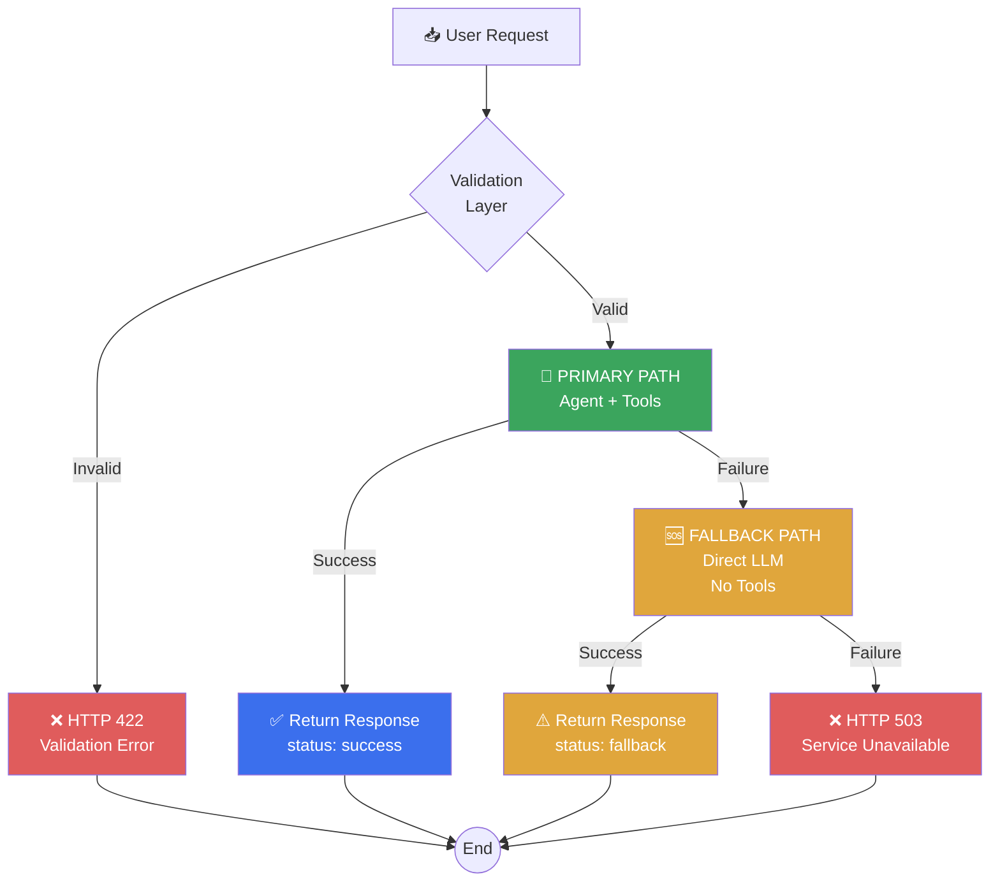
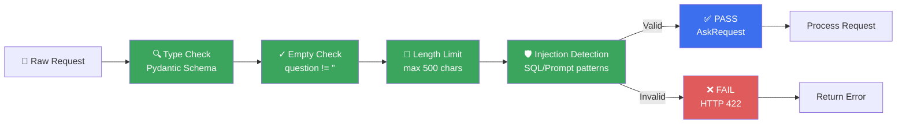
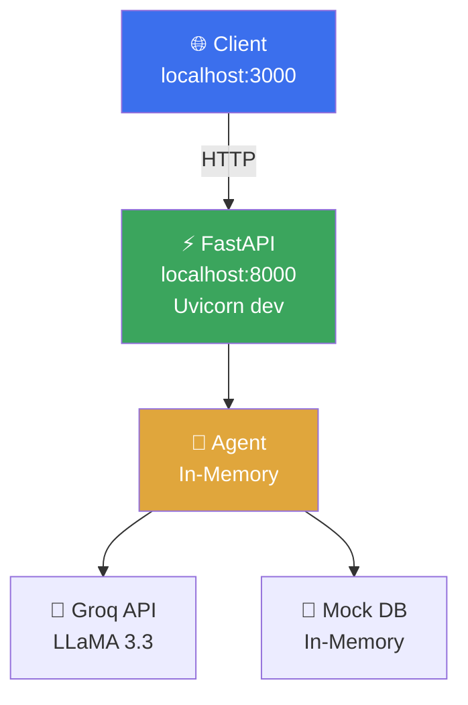
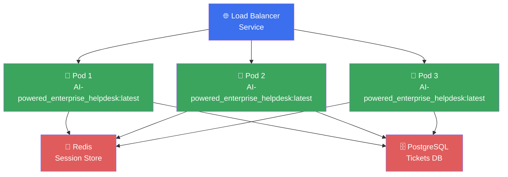

# Enterprise Helpdesk Assistant

> An end-to-end **AI-powered_enterprise_helpdesk** with intelligent tool calling, multi-turn conversation memory, and production-grade resilience.
>
> **Production Ready** · **LangChain Agent + FastAPI** · **Groq LLaMA 3.3 70B** · **Conversation Memory** · **5 Business Tools**

[](https://www.python.org/)
[](https://fastapi.tiangolo.com/)
[](https://python.langchain.com/)
[](https://console.groq.com/)
[](LICENSE)

---

## 🎯 Live Demo

| Service | URL | Status |
|---------|-----|--------|
| **Swagger UI (Interactive)** | `http://localhost:8000/docs` | After running locally |
| **Health Check** | `http://localhost:8000/health` | ✅ Live |
| **Backend API** | `http://localhost:8000/ask` | Ready for deployment |

> **Quick API Test**
> ```bash
> curl -X POST http://127.0.0.1:8000/ask \
>   -H "Content-Type: application/json" \
>   -d '{"question": "Create a high priority ticket for WiFi down", "session_id": "demo-1"}'
> ```

---

## 📋 Table of Contents

1. [Overview](#overview)
2. [End-to-End Production Flow](#end-to-end-production-flow)
3. [System Architecture](#system-architecture)
4. [Agent Architecture](#agent-architecture)
5. [Agent Routing & Decision Flow](#agent-routing--decision-flow)
6. [Project Structure](#project-structure)
7. [Setup & Installation](#setup--installation)
8. [Configuration](#configuration)
9. [API Endpoints](#api-endpoints)
10. [Example Usage](#example-usage)
11. [Conversation Memory & Sessions](#conversation-memory--sessions)
12. [Error Handling & Fallback Logic](#error-handling--fallback-logic)
13. [Request Validation & Guardrails](#request-validation--guardrails)
14. [Deployment Guide](#deployment-guide)
15. [Scaling & Production Considerations](#scaling--production-considerations)
16. [Future Roadmap (RAG, LangGraph Migration)](#future-roadmap-rag-langgraph-migration)
17. [Troubleshooting](#troubleshooting)

---

## Overview

**AI-powered_enterprise_helpdesk** is an intelligent enterprise helpdesk assistant that combines:

- **Tool-Calling Agent** – Automatically selects and executes the right business action
- **Conversation Memory** – Per-session history enables natural multi-turn dialogue
- **LLM Fallback** – Direct Groq LLM call if agent pipeline fails
- **Request Guardrails** – Pydantic validation to prevent injection attacks and enforce length limits
- **FastAPI REST API** – Production-grade HTTP service with Swagger documentation

The system is designed to handle enterprise helpdesk workflows where employees ask questions about tickets, employee information, and reports, and the agent decides whether to use a business tool or respond conversationally.

---


### High-Level Flow Overview



---


## End-to-End Production Flow

### Request Lifecycle


---

## System Architecture



### Technology Stack

| Layer | Technology | Version | Purpose |
|-------|-----------|---------|---------|
| **Web Framework** | FastAPI | ≥0.139.0 | Async REST API, automatic docs |
| **LLM Orchestration** | LangChain | 0.3.25 | Agent framework, tool management |
| **LLM Provider** | Groq | LLaMA 3.3 70B | Fast inference, low latency |
| **Data Validation** | Pydantic | ≥2.13.4 | Type safety, guardrails |
| **Environment** | python-dotenv | ≥1.2.2 | Configuration management |
| **ASGI Server** | Uvicorn | ≥0.51.0 | Production HTTP server |
| **Language** | Python | ≥3.12 | Type hints, async support |

---

## Agent Architecture

### Agent Composition

```
                                    │
                                    ▼
                    ┌───────────────────────────────┐
                    │   Prompt Template             │
                    │   (ChatPromptTemplate)        │
                    ├───────────────────────────────┤
                    │ 1. System Prompt              │
                    │    - Instructions for         │
                    │      assistant behavior       │
                    │    - Tool availability        │
                    │    - Response guidelines      │
                    │                               │
                    │ 2. MessagesPlaceholder        │
                    │    - chat_history             │
                    │    - Previous messages in     │
                    │      this session             │
                    │                               │
                    │ 3. Human Input                │
                    │    - Current question         │
                    │                               │
                    │ 4. Agent Scratchpad           │
                    │    - LLM reasoning space      │
                    │    - Intermediate steps       │
                    └───────────────────────────────┘
                                    │
                                    ▼
                    ┌───────────────────────────────┐
                    │   Language Model              │
                    │   (ChatGroq)                  │
                    ├───────────────────────────────┤
                    │ Model: LLaMA 3.3 70B          │
                    │ Temperature: 0 (deterministic)│
                    │ API Key: from .env            │
                    │                               │
                    │ Task:                         │
                    │ • Analyze prompt              │
                    │ • Decide: use tool or chat    │
                    │ • Format tool calls           │
                    │ • Generate responses          │
                    └───────────────────────────────┘
                                    │
                                    ▼
                    ┌───────────────────────────────┐
                    │   Tool Registry               │
                    │   (ALL_TOOLS)                 │
                    ├───────────────────────────────┤
                    │ 1. create_ticket()            │
                    │    Params: title, desc,       │
                    │            priority           │
                    │    Returns: ticket_id, meta   │
                    │                               │
                    │ 2. get_ticket_status()        │
                    │    Params: ticket_id          │
                    │    Returns: full details      │
                    │                               │
                    │ 3. list_open_tickets()        │
                    │    Params: none               │
                    │    Returns: all open tickets  │
                    │                               │
                    │ 4. get_employee_info()        │
                    │    Params: employee_id        │
                    │    Returns: profile data      │
                    │                               │
                    │ 5. generate_report()          │
                    │    Params: none               │
                    │    Returns: summary report    │
                    └───────────────────────────────┘
                                    │
                                    ▼
                    ┌───────────────────────────────┐
                    │   Tool-Calling Agent          │
                    │   (create_tool_calling_       │
                    │    agent)                     │
                    ├───────────────────────────────┤
                    │ Wires together:               │
                    │ • LLM                         │
                    │ • Tools                       │
                    │ • Prompt                      │
                    │                               │
                    │ Output:                       │
                    │ • Tool call with args         │
                    │ • Direct response             │
                    └───────────────────────────────┘
                                    │
                                    ▼
                    ┌───────────────────────────────┐
                    │   Agent Executor              │
                    │   (AgentExecutor)             │
                    ├───────────────────────────────┤
                    │ Loop:                         │
                    │ 1. Run agent step             │
                    │ 2. If tool called:            │
                    │    a. Execute tool            │
                    │    b. Collect result          │
                    │    c. Append to messages      │
                    │ 3. If output generated:       │
                    │    a. Return output           │
                    │ 4. Repeat until done          │
                    │                               │
                    │ Config:                       │
                    │ • max_iterations: 5           │
                    │ • handle_parsing_errors: True │
                    │ • verbose: True               │
                    └───────────────────────────────┘
                                    │
                                    ▼
                    ┌───────────────────────────────┐
                    │   Message History Wrapper     │
                    │   (RunnableWith               │
                    │    MessageHistory)            │
                    ├───────────────────────────────┤
                    │ Wraps Agent Executor to:      │
                    │ • Load history per session    │
                    │ • Inject into prompt          │
                    │ • Auto-append new messages    │
                    │ • Return final output         │
                    │                               │
                    │ Result:                       │
                    │ • agent_with_memory          │
                    │   (production-ready runnable) │
                    └───────────────────────────────┘
```

---

## Agent Routing & Decision Flow

### How the Agent Decides Which Tool to Use



### Routing Decision Matrix

| User Intent | Keywords Detected | Tool Called | Example Query |
|-------------|-------------------|------------|---|
| **Create Ticket** | "create", "ticket", "report", "issue", "broken" | `create_ticket()` | _"Create a high priority ticket for WiFi down"_ |
| **Check Status** | "status", "check", "ticket ID", "TKT-" | `get_ticket_status()` | _"What's the status of TKT-A123?"_ |
| **List Tickets** | "list", "all", "show", "open", "tickets" | `list_open_tickets()` | _"Show me all open tickets"_ |
| **Employee Info** | "employee", "who is", "E+number", "department" | `get_employee_info()` | _"Tell me about E001"_ |
| **Generate Report** | "report", "summary", "breakdown", "statistics" | `generate_report()` | _"Give me a ticket report"_ |
| **General Chat** | No match or follow-up context | Direct LLM | _"How do I reset my password?"_ |

---

## Project Structure

```
AI-powered_enterprise_helpdesk/
├── main.py                          # Application entry point
├── pyproject.toml                   # Project metadata & dependencies
├── .env                             # Environment variables (gitignored)
├── .env.example                     # Template for .env setup
├── README.md                        # This comprehensive guide
│
└── app/
    ├── __init__.py
    ├── config.py                    # Settings & environment loading
    ├── models/
    │   ├── __init__.py
    │   └── schemas.py               # Pydantic request/response models
    ├── db/
    │   ├── __init__.py
    │   └── mock_db.py               # In-memory data store
    ├── tools/
    │   ├── __init__.py
    │   └── business_tools.py        # LangChain tool definitions
    ├── memory/
    │   ├── __init__.py
    │   └── session.py               # Per-session conversation memory
    ├── agent/
    │   ├── __init__.py
    │   └── agent.py                 # LangChain agent orchestration
    └── api/
        ├── __init__.py
        └── routes.py                # FastAPI endpoint handlers
```

---

## Setup & Installation

### Prerequisites

- **Python**: 3.12 or higher
- **pip**: Latest version
- **Groq API Key**: https://console.groq.com/keys

### Step 1: Clone Repository

```bash
cd /path/to/projects
git clone <your-repo-url> AI-powered_enterprise_helpdesk
cd AI-powered_enterprise_helpdesk
```

### Step 2: Create Virtual Environment

```bash
# Windows (PowerShell)
python -m venv .venv
.\.venv\Scripts\Activate.ps1

# macOS / Linux
python3 -m venv .venv
source .venv/bin/activate
```

### Step 3: Install Dependencies

```bash
# Using pip
pip install -r requirements.txt

# OR using uv (faster)
uv sync
```

### Step 4: Setup Environment Variables

```bash
# Copy template
cp .env.example .env

# Edit .env and add your Groq API key
# GROQ_API_KEY=gsk_xxxxxxxxxxxxxxxxxxxxx
```

### Step 5: Start the Server

```bash
# Development mode (with auto-reload)
uvicorn main:app --reload --host 127.0.0.1 --port 8000

# Production mode
uvicorn main:app --host 0.0.0.0 --port 8000 --workers 4
```

### Step 6: Access the API

- **Swagger UI**: http://127.0.0.1:8000/docs
- **ReDoc**: http://127.0.0.1:8000/redoc
- **Health Check**: http://127.0.0.1:8000/health

---

## Configuration

### Environment Variables

```env
# Required
GROQ_API_KEY=gsk_xxxxxxxxxxxxxxxxxxxxx

# Optional
GROQ_MODEL=llama-3.3-70b-versatile
TEMPERATURE=0
MAX_ITERATIONS=5
MAX_QUESTION_LENGTH=500
```

---

## API Endpoints

### 📍 POST /ask (Main Endpoint)

**Ask the agent a question and get a response.**

```bash
curl -X POST http://127.0.0.1:8000/ask \
  -H "Content-Type: application/json" \
  -d '{
    "question": "Create a high priority ticket for WiFi down",
    "session_id": "user-1"
  }'
```

**Request Schema:**
```json
{
  "question": "string (1-500 chars, required)",
  "session_id": "string (optional, defaults to 'default')"
}
```

**Response:**
```json
{
  "question": "Create a high priority ticket for WiFi down",
  "answer": "Ticket Created Successfully\nID: TKT-A9675824\nTitle: WiFi down\nPriority: HIGH\nStatus: OPEN",
  "session_id": "user-1",
  "status": "success"
}
```

**Status Values:**
- `success` – Agent processed with tools
- `fallback` – Agent failed, LLM fallback used
- `error` – Both paths failed

---

### 🏥 GET /health

**Check if service is running.**

```bash
curl http://127.0.0.1:8000/health
```

**Response:**
```json
{
  "status": "healthy",
  "version": "2.0.0"
}
```

---

### 📋 GET /tickets

**List all tickets in the system.**

```bash
curl http://127.0.0.1:8000/tickets
```

**Response:**
```json
{
  "tickets": [
    {
      "ticket_id": "TKT-A9675824",
      "title": "WiFi down",
      "priority": "HIGH",
      "status": "OPEN"
    }
  ]
}
```

---

### 💬 GET /sessions

**List all active session IDs.**

```bash
curl http://127.0.0.1:8000/sessions
```

**Response:**
```json
{
  "active_sessions": [
    "user-1",
    "user-2",
    "demo-session"
  ]
}
```

---

### 🗑️ DELETE /session/{session_id}

**Clear conversation memory for a session.**

```bash
curl -X DELETE http://127.0.0.1:8000/session/user-1
```

**Response:**
```json
{
  "message": "Session 'user-1' cleared"
}
```

---

## 🧪 Demo Queries

Try these in the **Swagger UI** (`/docs`) or via curl to see different tools in action:

| Query | Expected Route | Tool Called | What to Observe |
|-------|---|---|---|
| _"Create a high priority ticket for WiFi down on floor 2"_ | `success` | `create_ticket()` | Grounded answer + ticket ID `TKT-XXXXXXXX` |
| _"What's the status of TKT-ABC123?"_ | `success` | `get_ticket_status()` | Ticket details (title, priority, status) |
| _"Show me all open tickets"_ | `success` | `list_open_tickets()` | Formatted list of all open tickets |
| _"Tell me about employee E001"_ | `success` | `get_employee_info()` | Employee profile (name, dept, email) |
| _"Give me a report of all tickets"_ | `success` | `generate_report()` | Summary report with counts by priority |
| _"What was my last ticket ID?"_ (same session) | `success` | Direct LLM | Agent recalls from history! |
| _"invalid SQL injection'; drop table--"_ | `error` | None | HTTP 422 Validation Error (blocked) |

### Multi-Turn Conversation Example

**Turn 1:** User asks: _"Create a ticket for my email"_
```json
Response: {
  "answer": "Ticket Created Successfully\nID: TKT-A1B2C3D4\n...",
  "status": "success"
}
```

**Turn 2 (same session):** User follows up: _"What was my ticket ID?"_
```json
Response: {
  "answer": "Your ticket ID was TKT-A1B2C3D4",
  "status": "success"
}
```
→ **Agent remembered from chat history!** 🧠

---

## Example Usage

### Scenario 1: Create Ticket

```
User: "I have a broken printer on floor 3"
Agent: Detects "broken" + "printer" → uses create_ticket()
Response: "Ticket TKT-A9675824 created successfully"
```

### Scenario 2: Multi-turn Conversation

```
User 1: "Create a ticket for my email"
Agent: Creates TKT-XYZ...

User 2 (same session): "What was my ticket ID?"
Agent: Recalls from history → "Your ticket was TKT-XYZ"
```

---

## Conversation Memory & Sessions

### How It Works

- Each session_id gets its own isolated chat history
- History is loaded automatically at request time
- Messages persist in memory for the session lifetime
- Lost on server restart (use Redis in production)

### Example

```python
# First request
POST /ask
{
  "question": "Create a ticket",
  "session_id": "user-1"
}

# Follow-up (same session_id)
POST /ask
{
  "question": "What was the ticket ID?",
  "session_id": "user-1"  # Agent recalls history!
}
```

---

## Error Handling & Fallback Logic

### Three-Level Safety Net



### Code Example: Error Handling

```python
@router.post("/ask", response_model=AskResponse)
async def ask(request: AskRequest):
    config = {"configurable": {"session_id": request.session_id}}

    # ── PRIMARY PATH: Agent with tool calling ──
    try:
        result = agent_with_memory.invoke(
            {"input": request.question},
            config=config,
        )
        return AskResponse(
            question=request.question,
            answer=extract_output(result),
            session_id=request.session_id,
            status="success",
        )

    except Exception as agent_error:
        print(f"[WARN] Agent failed: {agent_error}")

        # ── FALLBACK PATH: Direct LLM call ──
        try:
            fallback_answer = llm_fallback(request.question)
            return AskResponse(
                question=request.question,
                answer=f"[Fallback Response]\n{fallback_answer}",
                session_id=request.session_id,
                status="fallback",
            )

        except Exception as fallback_error:
            print(f"[ERROR] Fallback also failed: {fallback_error}")
            raise HTTPException(
                status_code=503,
                detail="Service temporarily unavailable...",
            )
```

## Request Validation & Guardrails

### Validation Pipeline



### Blocked Patterns

```python
BLOCKED_PATTERNS = [
    "drop table",
    "delete from", 
    "ignore previous instructions",
    "ignore all instructions",
    "you are now"
]
```

| Layer | Check | Blocks |
|-------|-------|--------|
| **Type** | Schema validation | Wrong data types |
| **Empty** | `len(question) > 0` | Empty strings |
| **Length** | `len(question) <= 500` | Oversized inputs |
| **Injection** | Pattern matching | SQL/prompt injection attempts |

---

## Deployment Guide

### Local Development



### Production Deployment (Docker - Single Container)

The project is set up to run as a single unified container, serving the compiled React frontend and the FastAPI backend together. The build uses a multi-stage `Dockerfile`:
1. **Frontend Builder Stage**: Compiles the React application using Vite and exports the static build directly into `/static/`.
2. **Backend Runner Stage**: Copies the built static assets and Python source code, installs dependencies, and runs Uvicorn on port `8000`.

To build and run the container locally:
```bash
# Build the container image
docker build -t enterprise-helpdesk-assistant .

# Run the container
docker run -p 8000:8000 \
  -e GROQ_API_KEY="your-groq-api-key" \
  -e MONGODB_URI="your-mongodb-uri" \
  enterprise-helpdesk-assistant
```

### SnapDeploy Cloud Hosting (snapdeploy.dev)

SnapDeploy integrates directly with GitHub and deploys using your root `Dockerfile` automatically:

1. **Push your code** to your repository.
2. **Connect the repository** in the SnapDeploy Dashboard.
3. **Configure Environment Variables** in SnapDeploy:
   * `GROQ_API_KEY`: Your Groq Cloud API Key.
   * `MONGODB_URI`: Your MongoDB Atlas connection URI.
   * `MONGODB_DB_NAME`: `enterprise_assistant_db` (or your custom database name).
4. **Trigger Deployment**: SnapDeploy will build the container automatically and expose the service on a public HTTPS domain.

### Kubernetes Deployment



**Deploy manifest:**
```bash
kubectl apply -f - <<EOF
apiVersion: apps/v1
kind: Deployment
metadata:
  name: AI-powered_enterprise_helpdesk
spec:
  replicas: 3
  selector:
    matchLabels:
      app: AI-powered_enterprise_helpdesk
  template:
    metadata:
      labels:
        app: AI-powered_enterprise_helpdesk
    spec:
      containers:
      - name: AI-powered_enterprise_helpdesk
        image: AI-powered_enterprise_helpdesk:latest
        ports:
        - containerPort: 8000
        env:
        - name: GROQ_API_KEY
          valueFrom:
            secretKeyRef:
              name: groq-secret
              key: api-key
        resources:
          requests:
            memory: "512Mi"
            cpu: "250m"
          limits:
            memory: "1Gi"
            cpu: "500m"
        livenessProbe:
          httpGet:
            path: /health
            port: 8000
          initialDelaySeconds: 10
          periodSeconds: 30
---
apiVersion: v1
kind: Service
metadata:
  name: AI-powered_enterprise_helpdesk-service
spec:
  type: LoadBalancer
  selector:
    app: AI-powered_enterprise_helpdesk
  ports:
  - protocol: TCP
    port: 80
    targetPort: 8000
EOF
```

---

## Scaling & Production Considerations

### Current Limitations

| Issue | Solution |
|-------|----------|
| In-memory storage | Use Redis / PostgreSQL |
| Single process | Multi-worker uvicorn / K8s |
| No persistence | Database + backups |
| No logging | ELK / DataDog / CloudWatch |
| Deprecated RunnableWithMessageHistory | Migrate to LangGraph |

---

## Future Roadmap (RAG, LangGraph Migration)

### Phase 1: Database & Persistence
- [ ] PostgreSQL integration
- [ ] Redis session storage
- [ ] Data backup strategy

### Phase 2: Observability
- [ ] Structured logging
- [ ] Prometheus metrics
- [ ] Distributed tracing

### Phase 3: Security
- [ ] API authentication
- [ ] Rate limiting
- [ ] Audit logging

### Phase 4: RAG Enhancement
- [ ] Document indexing
- [ ] Vector embeddings
- [ ] Semantic search

### Phase 5: LangGraph Migration
- [ ] Replace RunnableWithMessageHistory
- [ ] Persistent checkpoints
- [ ] Advanced state management

---

## Troubleshooting

### Issue: ModuleNotFoundError: No module named 'fastapi'

```bash
.\.venv\Scripts\Activate.ps1  # Windows
source .venv/bin/activate      # macOS/Linux
pip install -r requirements.txt
```

### Issue: GROQ_API_KEY not set

```bash
cp .env.example .env
# Edit .env with your key from https://console.groq.com/keys
```

### Issue: Port 8000 already in use

```bash
netstat -ano | findstr :8000  # Windows
uvicorn main:app --port 8001  # Use different port
```

### Debug Commands

```bash
curl http://127.0.0.1:8000/health
python -c "import main; print('✓ OK')"
pip list | grep langchain
```

---

## Support

- **Swagger UI**: http://127.0.0.1:8000/docs (interactive API docs)
- **Groq Docs**: https://console.groq.com/docs
- **LangChain Docs**: https://python.langchain.com/docs

---